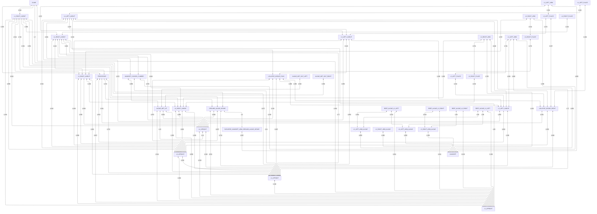

# Collision avoidance (unobstructed)

```mermaid
%%{ init: { "flowchart": { "defaultRenderer": "elk" } } }%%
graph TD

L2_UPRIGHT <-- 1.182 --> L1_UPRIGHT
L3_UPRIGHT <-- 1.392 --> L1_UPRIGHT
L4_UPRIGHT <-- 1.528 --> L1_UPRIGHT
ALGAE_NET_UP <-- 1.544 --> L1_UPRIGHT
L2_RIGHT_LINEUP <-- 1.699 --> L1_UPRIGHT
L3_RIGHT_LINEUP <-- 1.908 --> L1_UPRIGHT
L4_RIGHT_LINEUP <-- 1.95 --> L1_UPRIGHT
L1_RIGHT_LINEUP <-- 1.144 --> L1_UPRIGHT
GROUND_ALGAE_INTAKE <-- 2.031 --> L1_UPRIGHT
PROCESSOR <-- 1.927 --> L1_UPRIGHT
CLIMB <-- 1.282 --> L1_UPRIGHT
REEF_ALGAE_L2_LEFT <-- 1.941 --> L1_UPRIGHT
REEF_ALGAE_L2_RIGHT <-- 1.941 --> L1_UPRIGHT
REEF_ALGAE_L3_RIGHT <-- 2.109 --> L1_UPRIGHT
REEF_ALGAE_L3_LEFT <-- 2.109 --> L1_UPRIGHT
L3_UPRIGHT <-- 1.166 --> L2_UPRIGHT
L4_UPRIGHT <-- 1.348 --> L2_UPRIGHT
ALGAE_NET_UP <-- 1.369 --> L2_UPRIGHT
HANDOFF_CLEARS_CLIMBER <-- 2.34 --> L2_UPRIGHT
L2_LEFT_LINEUP <-- 1.166 --> L2_UPRIGHT
L2_RIGHT_LINEUP <-- 1.166 --> L2_UPRIGHT
GROUND_ALGAE_INTAKE <-- 1.722 --> L2_UPRIGHT
PROCESSOR <-- 1.573 --> L2_UPRIGHT
LOLLIPOP_INTAKE_RIGHT <-- 1.846 --> L2_UPRIGHT
LOLLIPOP_INTAKE_PUSH <-- 1.697 --> L2_UPRIGHT
L3_LEFT_LINEUP <-- 1.683 --> L2_UPRIGHT
L4_LEFT_LINEUP <-- 1.77 --> L2_UPRIGHT
L1_RIGHT_LINEUP <-- 1.677 --> L2_UPRIGHT
L3_RIGHT_LINEUP <-- 1.683 --> L2_UPRIGHT
L4_RIGHT_LINEUP <-- 1.77 --> L2_UPRIGHT
L4_UPRIGHT <-- 1.12 --> L3_UPRIGHT
ALGAE_NET_UP <-- 1.15 --> L3_UPRIGHT
L3_LEFT_LINEUP <-- 1.166 --> L3_UPRIGHT
L3_RIGHT_LINEUP <-- 1.166 --> L3_UPRIGHT
GROUND_ALGAE_INTAKE <-- 1.837 --> L3_UPRIGHT
PROCESSOR <-- 1.815 --> L3_UPRIGHT
LOLLIPOP_INTAKE_RIGHT <-- 2.055 --> L3_UPRIGHT
LOLLIPOP_INTAKE_PUSH <-- 1.975 --> L3_UPRIGHT
L2_LEFT_LINEUP <-- 1.683 --> L3_UPRIGHT
L4_LEFT_LINEUP <-- 1.542 --> L3_UPRIGHT
L1_RIGHT_LINEUP <-- 1.886 --> L3_UPRIGHT
L2_RIGHT_LINEUP <-- 1.683 --> L3_UPRIGHT
L4_RIGHT_LINEUP <-- 1.542 --> L3_UPRIGHT
ALGAE_NET_UP <-- 0.821 --> L4_UPRIGHT
L4_LEFT_LINEUP <-- 1.072 --> L4_UPRIGHT
L4_RIGHT_LINEUP <-- 1.072 --> L4_UPRIGHT
GROUND_ALGAE_INTAKE <-- 2.048 --> L4_UPRIGHT
PROCESSOR <-- 2.011 --> L4_UPRIGHT
LOLLIPOP_INTAKE_RIGHT <-- 2.191 --> L4_UPRIGHT
LOLLIPOP_INTAKE_PUSH <-- 2.133 --> L4_UPRIGHT
L2_LEFT_LINEUP <-- 1.865 --> L4_UPRIGHT
L3_LEFT_LINEUP <-- 1.636 --> L4_UPRIGHT
L1_RIGHT_LINEUP <-- 2.022 --> L4_UPRIGHT
L2_RIGHT_LINEUP <-- 1.865 --> L4_UPRIGHT
L3_RIGHT_LINEUP <-- 1.636 --> L4_UPRIGHT
ALGAE_NET_OUT_LEFT <-- 1.546 --> ALGAE_NET_UP
ALGAE_NET_OUT_RIGHT <-- 1.546 --> ALGAE_NET_UP
HANDOFF_CLEARS_CLIMBER <-- 1.886 --> ALGAE_NET_UP
HANDOFF_CLEARS_CLIMBER <-- 1.129 --> HANDOFF
ELEVATOR_HANDOFF_ARM_GROUND_ALGAE_INTAKE <-- 1.607 --> HANDOFF
L2_RIGHT_ARM <-- 1.166 --> HANDOFF
L3_RIGHT_ARM <-- 1.166 --> HANDOFF
L2_LEFT_ARM <-- 1.805 --> HANDOFF
L3_LEFT_ARM <-- 1.805 --> HANDOFF
L2_LEFT_ARM_ALGAE <-- 1.805 --> HANDOFF
L2_RIGHT_ARM_ALGAE <-- 1.166 --> HANDOFF
L3_LEFT_ARM_ALGAE <-- 1.805 --> HANDOFF
L3_RIGHT_ARM_ALGAE <-- 1.166 --> HANDOFF
L4_LEFT_LINEUP <-- 2.021 --> HANDOFF_CLEARS_CLIMBER
L4_RIGHT_LINEUP <-- 1.821 --> HANDOFF_CLEARS_CLIMBER
GROUND_ALGAE_INTAKE <-- 1.4 --> ELEVATOR_HANDOFF_ARM_GROUND_ALGAE_INTAKE
L2_LEFT_PLACE <-- 1.242 --> L2_LEFT_LINEUP
LOLLIPOP_INTAKE_PUSH <-- 1.866 --> L2_LEFT_LINEUP
L3_LEFT_LINEUP <-- 1.166 --> L2_LEFT_LINEUP
L4_LEFT_LINEUP <-- 1.646 --> L2_LEFT_LINEUP
L2_LEFT_ARM <-- 1.802 --> L2_LEFT_LINEUP
L2_RIGHT_PLACE <-- 1.242 --> L2_RIGHT_LINEUP
L1_RIGHT_LINEUP <-- 1.331 --> L2_RIGHT_LINEUP
L3_RIGHT_LINEUP <-- 1.166 --> L2_RIGHT_LINEUP
L4_RIGHT_LINEUP <-- 1.646 --> L2_RIGHT_LINEUP
L2_RIGHT_ARM <-- 1.802 --> L2_RIGHT_LINEUP
L1_RIGHT_LINEUP <-- 1.851 --> GROUND_ALGAE_INTAKE
PROCESSOR <-- 1.174 --> GROUND_ALGAE_INTAKE
CLIMB <-- 1.7 --> GROUND_ALGAE_INTAKE
L1_RIGHT_LINEUP <-- 1.722 --> PROCESSOR
CLIMB <-- 1.525 --> PROCESSOR
LOLLIPOP_INTAKE_PUSH <-- 1.299 --> LOLLIPOP_INTAKE_RIGHT
L3_LEFT_PLACE <-- 2.237 --> LOLLIPOP_INTAKE_RIGHT
L4_LEFT_PLACE <-- 2.436 --> LOLLIPOP_INTAKE_RIGHT
L2_LEFT_ARM <-- 2.466 --> LOLLIPOP_INTAKE_RIGHT
L2_RIGHT_ARM <-- 1.785 --> LOLLIPOP_INTAKE_RIGHT
L3_LEFT_LINEUP <-- 2.143 --> LOLLIPOP_INTAKE_PUSH
L4_LEFT_LINEUP <-- 2.249 --> LOLLIPOP_INTAKE_PUSH
L3_LEFT_PLACE <-- 1.272 --> L3_LEFT_LINEUP
L4_LEFT_LINEUP <-- 1.418 --> L3_LEFT_LINEUP
L3_LEFT_ARM <-- 1.537 --> L3_LEFT_LINEUP
L3_RIGHT_PLACE <-- 1.272 --> L3_RIGHT_LINEUP
L1_RIGHT_LINEUP <-- 1.541 --> L3_RIGHT_LINEUP
L4_RIGHT_LINEUP <-- 1.418 --> L3_RIGHT_LINEUP
L3_RIGHT_ARM <-- 1.537 --> L3_RIGHT_LINEUP
L4_LEFT_PLACE <-- 1.242 --> L4_LEFT_LINEUP
L4_RIGHT_PLACE <-- 1.242 --> L4_RIGHT_LINEUP
L1_RIGHT_LINEUP <-- 1.786 --> L4_RIGHT_LINEUP
CLIMB <-- 1.044 --> L1_RIGHT_LINEUP
L2_LEFT_ARM <-- 1.731 --> L2_LEFT_PLACE
L3_LEFT_ARM <-- 1.514 --> L3_LEFT_PLACE
L2_RIGHT_ARM <-- 1.731 --> L2_RIGHT_PLACE
L3_RIGHT_ARM <-- 1.514 --> L3_RIGHT_PLACE
REEF_ALGAE_L2_LEFT <-- 1.519 --> L2_LEFT_ARM_ALGAE
REEF_ALGAE_L3_LEFT <-- 1.08 --> L2_LEFT_ARM_ALGAE
REEF_ALGAE_L2_LEFT <-- 1.519 --> L3_LEFT_ARM_ALGAE
REEF_ALGAE_L3_LEFT <-- 1.08 --> L3_LEFT_ARM_ALGAE
REEF_ALGAE_L2_RIGHT <-- 1.519 --> L3_RIGHT_ARM_ALGAE
REEF_ALGAE_L3_RIGHT <-- 1.08 --> L3_RIGHT_ARM_ALGAE
```
